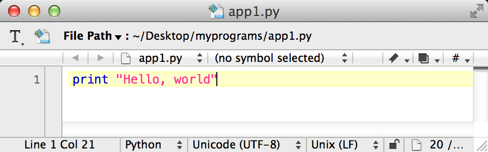

:doctype: book
:toc:
++++

++++

= So You Want To Learn Python

This page is used to capture some useful tips-n-tricks to create http://www.diveintopython.net/toc/index.html[Python programs]. It's for my nephew, but it can 
be for anyone that you want to share it with.

== Getting Python onto your computer

Do you have a Mac? Great! You don't need to do anything more, because you already have Python. Where is it? You won't find it underneath `Applications`. So try this:

. Hit `Cmd+Spacebar`. You should see a little box pop-up named *Spotlight* in the top-right corner.
. Enter `terminal`. An application called *Terminal* should appear.
+
image::images/spotlight.png[]

. Pick it with the mouse.
. A new window should open up. It's probably white with black text.
. Type `python -V` to see what version of Python you have. (Note the capital V)
+
image::images/terminal.png[]

. The last thing you need is an editor to write Python programs. Go to http://www.barebones.com/products/TextWrangler/[TextWrangler] and click on the `Download` button.
Don't worry; it's free!
. After it finishes, open *TextWranger_<version>.dmg*.
. You'll see a pop-up screen. Drag the *TextWrangle* icon into *Applications*.
. The first time you launch *TextWranger*, you might see something like *TextWrangler is an application downloaded from the Internet. Are you sure you want to open it?*.
Click *Open*.

You're all set!

== Your first Python program

To get off the ground, let's write something really simple. For starters, you might want to put all your programs in one place.

. Using *Finder*, create a new folder on your Desktop. Call it *myprograms*.
+
image::images/myprograms.png[]

. Open `myprograms`.
. Position the windows so you can see the terminal and the `myprograms` at the same time.
. Inside Terminal:
.. Type `cd ~/Desktop/myprograms` (`cd` lets you *Change Directories* to that folder you just made.)
.. Type `touch app1.py` (this creates an empty file so we can write our first program.)
. Inside Finder:
.. You should see `app1.py` appear automatically.
.. Right click `app1.py` and navigate to `Open With` -> `Other...`.
.. Scroll down and pick *TextWrangler*. Check *Always Open With*. Then click *Open*.
+
image:images/pick_textwrangler.png[]

.. You'll see an option to register. Click *Cancel*.
. Inside TextWrangler:
.. Enter a tiny program.
+

.. Either navigate to *File* -> *Save*, or simply hit `Cmd+S` and save your new program.
. Inside Terminal:
.. Type `python app1.py`, and you should see the greeting get printed to the screen:
+
----
$ python app1.py 
Hello, world
----

You just created your first Python program! 

Can you guess what's happening?

* `print` is a command to write something to the screen.
* Anything inside the double-quotes is what gets written to screen. The stuff inside the double-quotes is called a *string*, which is short for *string of characters*.

This is probably the absolute simplest program one could possibly write in Python. But don't let that fool you. Giant companies like Google, Amazon, eBay, and others
use Python to run big stuff. And I use it all the time as well.

=== Questions?

[qanda]
Why can't I use TextEdit?::
TextEdit comes with your Mac, but unfortunately, it tries to make the text too fancy. To write Python programs, you need things to be *plain text*.

What about Microsoft Word or some other word processor?::
These tools are better used when writing papers for school. They let you format the text with *bold*, _italics_, and other things. This type of stuff
confuses python and won't run very well. That's why there are instructions to download *TextWrangle*.

Why does my program inside TextWrangle show different colors?::
If you look at the program inside TextWrangle up above, you'll notice that `print` is black while `"Hello, world"` is red. That's called
*syntax highlighting*, a handy feature that as you get more familiar with Python, will let you spot mistakes quicker. Notice at the bottom of the editor, 
you can see *Python*. That's because TextWrangler speaks Python and can help you out.