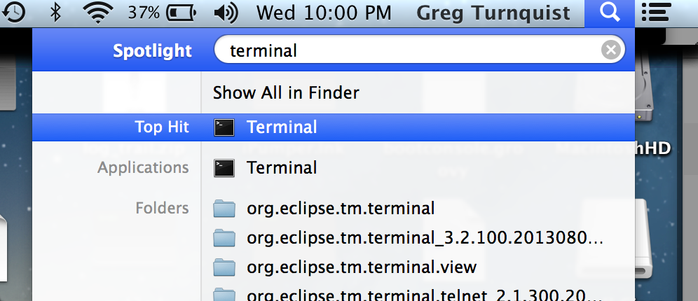
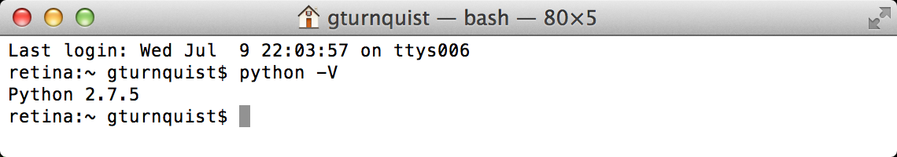
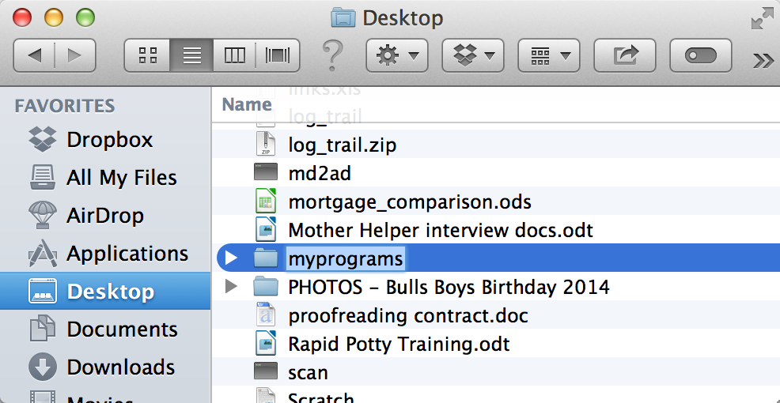
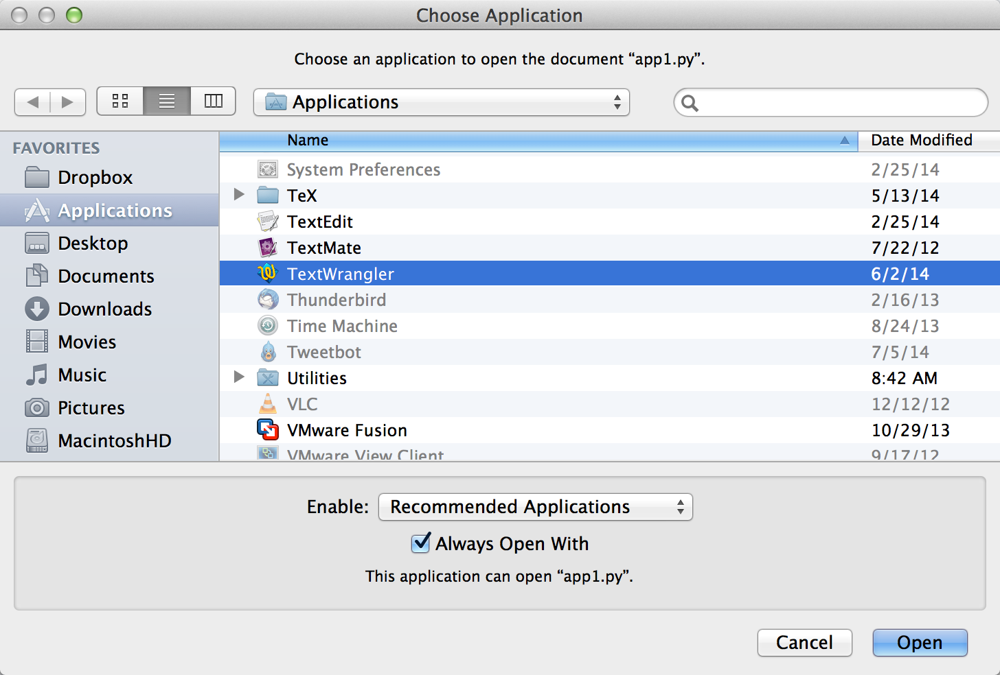

:doctype: book
:toc:

= So You Want To Learn Python

This page is used to capture some useful tips-n-tricks to create http://www.diveintopython.net/toc/index.html[Python programs]. It's for my nephew, but it can 
be for anyone that you want to share it with.

== Getting Python onto your computer

Do you have a Mac? Great! You don't need to do anything more, because you already have Python. Where is it? You won't find it underneath `Applications`. So try this:

. Hit `Cmd+Spacebar`. You should see a little box pop-up named *Spotlight* in the top-right corner.
. Enter `terminal`. An application called *Terminal* should appear.
+

. Pick it with the mouse.
. A new window should open up. It's probably white with black text.
. Type `python -V` to see what version of Python you have. (Note the capital V)
+

. The last thing you need is an editor to write Python programs. Go to http://www.barebones.com/products/TextWrangler/[TextWrangler] and click on the `Download` button.
Don't worry; it's free!
. After it finishes, open *TextWranger_<version>.dmg*.
. You'll see a pop-up screen. Drag the *TextWrangle* icon into *Applications*.
. The first time you launch *TextWranger*, you might see something like *TextWrangler is an application downloaded from the Internet. Are you sure you want to open it?*.
Click *Open*.

You're all set!

== Your first Python program

To get off the ground, let's write something really simple. For starters, you might want to put all your programs in one place.

. Using *Finder*, create a new folder on your Desktop. Call it *myprograms*.
+

. Open `myprograms`.
. Position the windows so you can see the terminal and the `myprograms` at the same time.
. Inside Terminal:
.. Type `cd ~/Desktop/myprograms` (`cd` lets you *Change Directories* to that folder you just made.)
.. Type `touch app1.py` (this creates an empty file so we can write our first program.)
. Inside Finder:
.. You should see `app1.py` appear automatically.
.. Right click `app1.py` and navigate to `Open With` -> `Other...`.
.. Scroll down and pick *TextWrangler*. Check *Always Open With*. Then click *Open*.
+

.. You'll see an option to register. Click *Cancel*.
. Inside TextWrangler:
.. Enter a tiny program.
+
[source,python]
----
print "Hello, world!" 
----
.. Either navigate to *File* -> *Save*, or simply hit `Cmd+S` and save your new program.
. Inside Terminal:
.. Type `python app1.py`, and you should see the greeting get printed to the screen:
+
----
$ python app1.py 
Hello, world
----

You just created your first Python program!